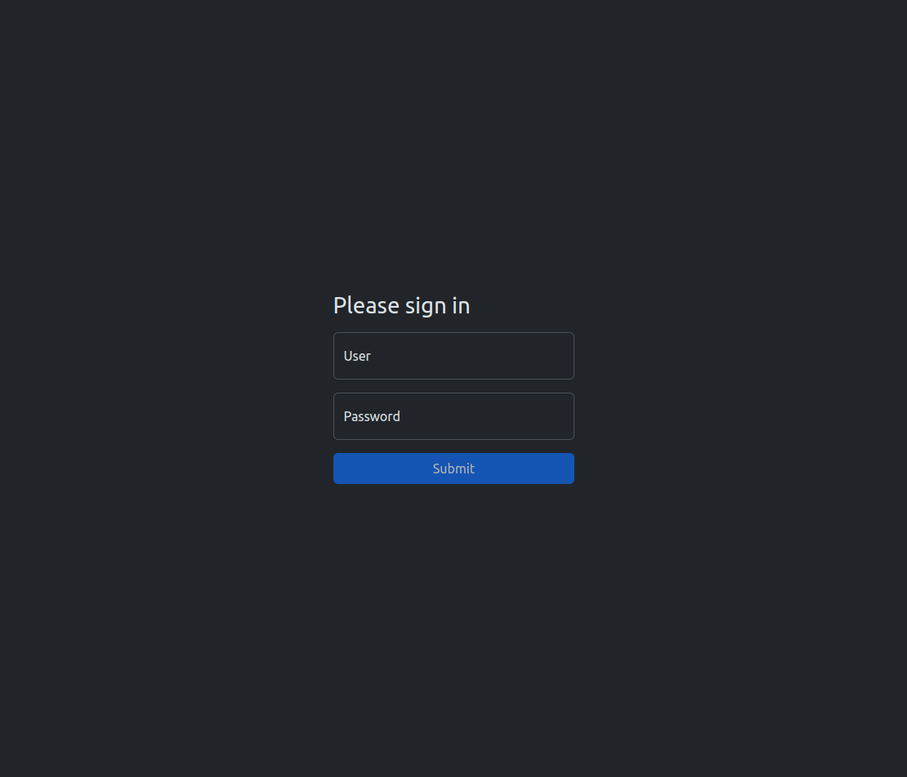
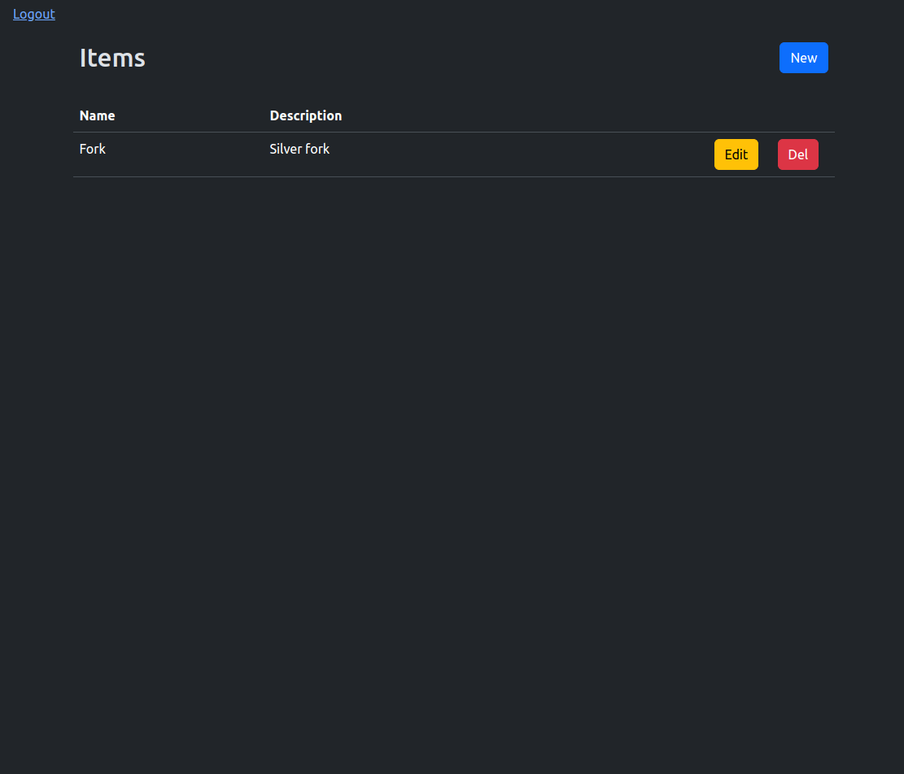
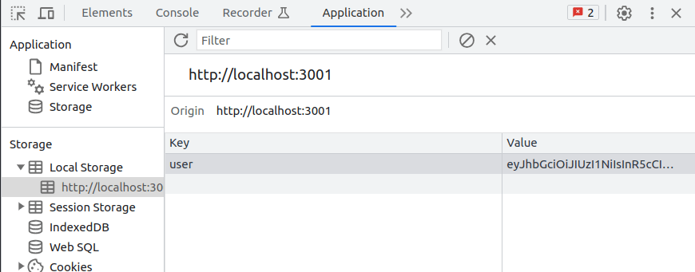

# CRUD Item
Este repositório contém um projeto frontend construído usando React JS + Vite. Este projeto interage com uma API que permite o acesso a um CRUD simples com autenticação básica, simulando um dashboard com login e logout de usuário, criação, listagem, atualização e deleção de itens.

Você pode executar o backend para se comunicar com esta aplicação através de requisições HTTP. Para isso, siga as instruções do repositório em que ele se encontra:

```markdown
https://github.com/FCipolato/crud-item-back
```

## Tecnologias Utilizadas

- [Vite](https://vitejs.dev/) - Ferramenta de construção de front-end que melhora significativamente a experiência de desenvolvimento.
- [ReactJS](https://react.dev/) - Biblioteca front-end JavaScript de código aberto com foco em criar interfaces de usuário em páginas web.
  - [Bootstrap](https://github.com/twbs/bootstrap) - Biblioteca para desenvolvimento de componentes de interface e front-end para sites e aplicações web, usando HTML, CSS e JavaScript, baseado em modelos de design para a tipografia.
  - [Axios](https://github.com/axios/axios) - Cliente HTTP baseado em Promises para fazer requisições.
  - [React Router Dom](https://github.com/remix-run/react-router) - Biblioteca para o React criada com o objetivo de resolver problemas de rotas para as páginas de um site e tornar o desenvolvimento simples e escalável.
  - [Sass](https://www.npmjs.com/package/sass) - CSS com superpoderes :D

## Instalação

1. Clonar o repositório:

```bash
$ git clone https://github.com/FCipolato/crud-item-front.git
```

2. Instalar dependências:

```bash
$ yarn install
```

## Execução

É possível executar o projeto de duas formas.

A. Localmente:

```bash
$ yarn dev
```

B. Dockerfile:

```bash
# Passo 1
$ docker build --pull --rm -f "Dockerfile" -t cruditemfront:latest "."

# Passo 2
$ docker run --rm -d -p 3001:3001/tcp cruditemfront:latest 
```

## Funcionamento

É necessário primeiro criar um novo usuário através do endpoint `POST /users/signup` do backend, após isso é possível então se autenticar na aplicação na tela de login.

<h1 align="center">
  
</h1>

Estando agora logado, pode-se criar, listar, atualizar e deletar de itens no dashboard.

<h1 align="center">
  
</h1>

Todas as telas, tirando a de login, são protegidas e não são acessadas sem estar com um access token salvo no navegador.

<h1 align="center">
  
</h1>

Se o access token for inválido, no momento de ser realizado uma nova requisição ao backend, esse token será removido e o usuário será redirecionado a tela de login. E se por acaso um token estiver salvo e o usuário tentar acessar a página de login, ele será redirecionado ao dashboard.